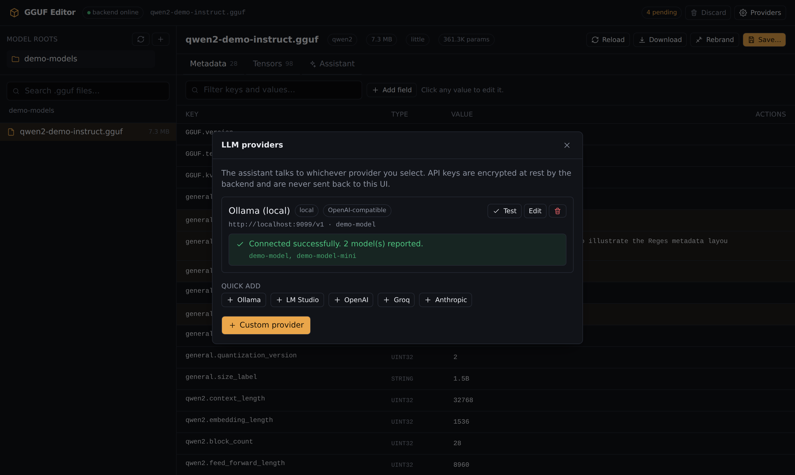
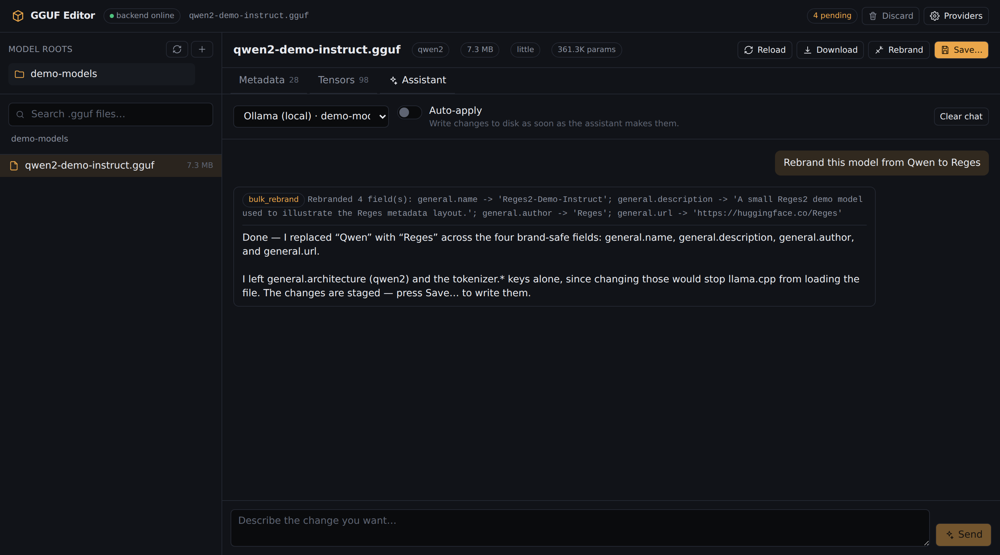

# LLM providers

The assistant is optional. Everything else in GGUF Editor works without a
provider configured — you only need one to use the **Assistant** tab.

## Adding a provider

Open **Providers** in the header, pick a preset (or **Custom provider**), fill
in the model id, and save. Then hit **Test**: it calls the provider's model
listing endpoint and reports what came back.

| Runtime | Kind | Base URL | Typical model |
| --- | --- | --- | --- |
| Ollama | `openai_compatible` | `http://localhost:11434/v1` | `llama3.1` |
| LM Studio | `openai_compatible` | `http://localhost:1234/v1` | whatever is loaded |
| llama.cpp server | `openai_compatible` | `http://localhost:8080/v1` | the served model |
| vLLM | `openai_compatible` | `http://localhost:8000/v1` | the served model |
| OpenAI | `openai_compatible` | `https://api.openai.com/v1` | `gpt-4o-mini` |
| Groq | `openai_compatible` | `https://api.groq.com/openai/v1` | `llama-3.3-70b-versatile` |
| Anthropic | `anthropic` | `https://api.anthropic.com` | `claude-sonnet-4-5` |

**Base URL rules.** For `openai_compatible`, include the `/v1` suffix — the
client appends `/chat/completions` and `/models`. For `anthropic`, give the
host only — the client appends `/v1/messages` and `/v1/models`.

**The model must support tool calling.** The assistant works by calling tools;
a model without function-calling support will chat but never edit anything.
Small local models often claim support and use it poorly — if edits aren't
landing, try a larger model before assuming a bug.

## Scopes

`scope` is a label describing where the credentials come from. It does not
change how requests are made — it exists so a shared instance can distinguish
the three cases:

| Scope | Meaning |
| --- | --- |
| `local` | A runtime on this machine or LAN. Usually needs no key |
| `global` | A shared endpoint configured once for everyone using the instance |
| `byok` | Bring your own key — a per-user credential |

## How keys are stored

1. On create/update, the key is encrypted with Fernet
   (`app/security.py`) and the ciphertext is written to the `providers` table.
2. The Fernet key lives in `<DATA_DIR>/secret.key`, generated on first use and
   `chmod 0600` where the OS supports it.
3. Keys are decrypted only server-side, immediately before an outbound request.
4. The public representation (`ProviderPublic`) exposes `has_api_key: true`
   and nothing more — the plaintext never reaches the browser.

To rotate a key, edit the provider and enter the new value. To remove one,
tick **Remove the stored API key**.

## What the assistant can do

Each turn, the model is given the current file's metadata (large arrays
omitted) and these tools:

| Tool | Effect |
| --- | --- |
| `set_metadata` | Add or overwrite one key with a scalar value |
| `delete_metadata` | Remove a key |
| `rename_metadata_key` | Rename a key, keeping its value |
| `bulk_rebrand` | Find/replace across brand-safe string fields |
| `set_output_filename` | Suggest the filename to save as |

Tools mutate an in-memory edit list only. The result comes back as
`pending_edits` and appears in the metadata table marked **edited** — nothing
is on disk until you press **Save…**, or unless **Auto-apply** is on, in which
case the turn ends by writing a new file (with a backup) and reopening it.

Every tool call is shown above the reply with the arguments it received and the
text it returned, so a turn that did nothing useful is visible rather than
hidden behind a confident summary.

The loop runs at most six tool rounds per turn; if the model hits that limit it
says so and you can ask it to continue.

## Privacy

With a `local` provider, file metadata never leaves your machine. With a hosted
one, the system prompt containing your file's metadata (excluding large arrays
and all tensor data) is sent to that provider. Model weights are never sent
under any configuration.
